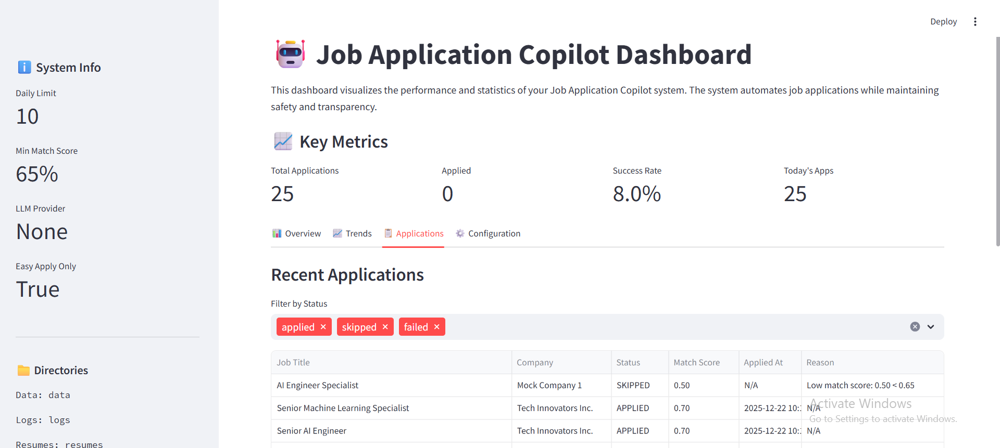

<div align="center">

<h1>⚡ TalentForge AI</h1>
<h3>Autonomous Career Intelligence & Application Orchestration Platform</h3>

<p>
  
  
  
  
  
  
</p>

<p>
  <strong>TalentForge AI</strong> is a production-grade autonomous job application platform that combines AI-powered resume matching, browser automation, and real-time analytics into one intelligent orchestration system — so you can focus on interviews, not applications.
</p>

</div>

---

## 📌 Table of Contents

- [Overview](#-overview)
- [Key Features](#-key-features)
- [System Architecture](#️-system-architecture)
- [Dashboard](#-dashboard)
- [Quick Start](#-quick-start)
- [Configuration](#️-configuration)
- [AI Intelligence Engine](#-ai-intelligence-engine)
- [Safety & Compliance](#️-safety--compliance)
- [Job Processing Workflow](#-job-processing-workflow)
- [Application Lifecycle](#-application-lifecycle)
- [Project Structure](#-project-structure)
- [Deployment](#-deployment)
- [Extending the Platform](#-extending-the-platform)
- [Testing](#-testing--development)
- [Troubleshooting](#-troubleshooting)
- [API Reference](#-api-reference)
- [Contributing](#-contributing)
- [Disclaimer](#️-disclaimer)

---

## 🧠 Overview

TalentForge AI automates the entire job application pipeline — from discovery to submission — while keeping you in control. Built on a clean **Controller → Service → Storage** architecture, it intelligently scores jobs against your resume using large language models, filters out low-quality matches, handles LinkedIn Easy Apply through browser automation, and tracks every outcome in a structured SQLite database.

The system is designed with safety-first principles: rate limiting, daily caps, dry-run testing, and optional human confirmation at every critical step.

---

## ✨ Key Features

| Category | Feature |
|---|---|
| 🤖 AI Matching | LLM-powered resume ↔ JD compatibility scoring via Groq, OpenRouter, or HuggingFace |
| 🔍 Job Discovery | Automated multi-keyword LinkedIn scraping with configurable filters |
| 📊 Smart Filtering | Company & keyword blacklists, scoring thresholds, Easy Apply detection |
| 🖥️ Browser Automation | Headless Playwright with anti-detection, human-like behavior simulation |
| 📈 Real-Time Analytics | Streamlit dashboard with trends, distributions, and CSV export |
| 🛡️ Safety Controls | Daily caps, rate limiting, user confirmation, dry-run mode |
| 🔄 Lifecycle Tracking | Full SQLite state machine: discovered → scored → queued → applied/skipped/failed |
| 🔌 Extensible Design | Plugin-ready platform layer — add Indeed, Glassdoor, or any ATS in hours |

---

## 🏗️ System Architecture

TalentForge AI is organized into six clearly separated layers:

```
╔══════════════════════════════════════════════════════════════╗
║                     CONTROLLER LAYER                        ║
║  controllers/job_controller.py                              ║
║  └─ JobApplicationController — master orchestrator          ║
╠══════════════════════════════════════════════════════════════╣
║                      SERVICE LAYER                          ║
║  services/                                                  ║
║  ├─ job_intelligence.py   — AI scoring & filtering engine   ║
║  ├─ apply_orchestrator.py — application pipeline routing    ║
║  ├─ human_control.py      — safety, limits, confirmations   ║
║  ├─ analytics.py          — metrics, trends, reporting      ║
║  └─ config_manager.py     — centralized config management   ║
╠══════════════════════════════════════════════════════════════╣
║                      STORAGE LAYER                          ║
║  storage/database.py — SQLite persistence & lifecycle mgmt  ║
╠══════════════════════════════════════════════════════════════╣
║                       MODEL LAYER                           ║
║  models/                                                    ║
║  ├─ job.py     — strongly-typed job & application structs   ║
║  └─ config.py  — validated configuration models             ║
╠══════════════════════════════════════════════════════════════╣
║                      PLATFORM LAYER                         ║
║  platforms/                                                 ║
║  ├─ base.py      — abstract platform interface              ║
║  └─ linkedin.py  — LinkedIn-specific implementation         ║
╠══════════════════════════════════════════════════════════════╣
║                     INTERFACE LAYER                         ║
║  dashboard/web_dashboard.py  — Streamlit monitoring UI      ║
║  main_modern.py              — CLI entry point              ║
╚══════════════════════════════════════════════════════════════╝
```

### Data Flow

```
LinkedIn Platform
      │
      ▼
 Job Discovery ──► Intelligence Scoring ──► Safety Filtering
                           │
                           ▼
               Application Routing (Easy Apply / External ATS / Manual)
                           │
                           ▼
              Browser Automation ──► SQLite Database ──► Dashboard
```

---

## 📊 Dashboard

The **Streamlit dashboard** (`dashboard/web_dashboard.py`) gives you a live, tab-based view of the entire system.



> Live dashboard showing 25 processed applications — key system info in the sidebar (daily limit, min match score, LLM provider, Easy Apply mode), headline metrics across the top, and the Applications tab with per-row match scores, statuses, and skip reasons. Filter by applied / skipped / failed and export everything as CSV in one click.

**Overview Tab** — Status distribution pie chart and match score histogram alongside four headline KPIs: Total Applications, Applied, Success Rate, and Today's Count.

**Trends Tab** — Daily application line chart over the last 7 days and a top-companies bar chart ranked by application volume.

**Applications Tab** — Multi-select status filter over the 100 most recent applications, showing job title, company, status, match score, timestamp, and skip/fail reason. One-click CSV export.

**Configuration Tab** — Live JSON view of your active LinkedIn settings, matching thresholds, safety limits, and blacklists.

**Sidebar** — Daily limit, min match score, LLM provider, Easy Apply mode, and directory paths at a glance.

To launch:

```bash
streamlit run dashboard/web_dashboard.py
# Opens at http://localhost:8501
```

---

## 🚀 Quick Start

### Prerequisites

- Python 3.11+
- A LinkedIn account
- A Groq API key — free tier at [console.groq.com](https://console.groq.com)
- Your resume as `resumes/resume.pdf`

### 1. Clone the Repository

```bash
git clone https://github.com/yourusername/talentforge-ai.git
cd talentforge-ai
```

### 2. Create & Activate a Virtual Environment

```bash
python -m venv venv

# macOS / Linux
source venv/bin/activate

# Windows
venv\Scripts\activate
```

### 3. Install Dependencies

```bash
pip install -r requirements.txt
playwright install chromium
```

### 4. Configure Environment

```bash
cp .env.sample .env
cp config_sample.ini config.ini
```

Edit `.env` with your credentials:

```env
GROQ_API_KEY=gsk_your_key_here
LINKEDIN_EMAIL=your.email@example.com
LINKEDIN_PASSWORD=your_password
MAX_DAILY_APPLICATIONS=10
MIN_MATCH_SCORE=0.65
DRY_RUN=true
```

### 5. Add LinkedIn Cookies

1. Install the [Cookie-Editor](https://cookie-editor.cgagnier.ca/) browser extension
2. Log in to LinkedIn in your browser
3. Click Cookie-Editor → Export → Export as JSON
4. Save the file as `cookies/linkedin_cookies.json`

### 6. Add Your Resume

```
resumes/resume.pdf     ← required
resumes/resume.txt     ← optional, improves keyword matching speed
```

### 7. Run the System

```bash
# Always start with a dry run — no actual applications are submitted
python main_modern.py --dry-run

# Production run with keywords from your config
python main_modern.py

# Custom keyword search with a job cap
python main_modern.py --keywords "AI Engineer" "ML Engineer" --max-jobs 25

# Launch the monitoring dashboard
streamlit run dashboard/web_dashboard.py
```

---

## ⚙️ Configuration

All settings are driven by your `.env` file and `models/config.py`. Standard deployments require no source code edits.

The repository ships two configuration templates:

- **`.env.sample`** — environment variables for secrets and runtime flags
- **`config_sample.ini`** — INI-style config covering LinkedIn credentials, search parameters, scoring thresholds, browser settings, and logging

### Key Settings Reference

**LinkedIn**

| Variable | Default | Description |
|---|---|---|
| `LINKEDIN_EMAIL` | — | Your LinkedIn login email |
| `LINKEDIN_PASSWORD` | — | Your LinkedIn password |
| `MAX_APPLICATIONS_PER_DAY` | `10` | Hard daily application cap |
| `EASY_APPLY_ONLY` | `true` | Skip jobs without Easy Apply |
| `REMOTE_ONLY` | `true` | Filter for remote positions only |

**Matching & LLM**

| Variable | Default | Description |
|---|---|---|
| `GROQ_API_KEY` | — | Primary LLM provider (recommended) |
| `OPENROUTER_API_KEY` | — | Alternative LLM provider |
| `HF_API_KEY` | — | HuggingFace inference API key |
| `MIN_MATCH_SCORE` | `0.65` | Minimum score to queue a job |
| `PREFERRED_MATCH_SCORE` | `0.80` | Score threshold for auto-submission |

**Safety**

| Variable | Default | Description |
|---|---|---|
| `DRY_RUN` | `true` | Simulate the full pipeline without submitting |
| `REQUIRE_USER_CONFIRMATION` | `false` | Prompt before every application |
| `CONFIRMATION_TIMEOUT` | `30` | Seconds to wait for confirmation |

**Blacklists** — configured in `models/config.py`:

```python
company_blacklist  = ["Company A", "Company B"]
keyword_blacklist  = ["unpaid", "commission only", "internship"]
required_keywords  = ["python", "machine learning"]
bonus_keywords     = ["pytorch", "llm", "nlp", "transformers"]
```

---

## 🧠 AI Intelligence Engine

`services/job_intelligence.py` scores every discovered job before any application decision is made.

### Scoring Breakdown

| Factor | Weight | Method |
|---|---|---|
| LLM Resume Match | 70% | Full resume ↔ JD semantic analysis via Groq / OpenRouter |
| Keyword Alignment | 30% | Required and bonus keyword presence scoring |
| Company Filter | Override | Instant skip on blacklisted companies |
| Location Preference | Modifier | Boosts remote or preferred-location matches |

### Score Thresholds

```
≥ 0.80     →  Excellent match — auto-apply
0.65–0.79  →  Good match — queued for application
< 0.65     →  Low match — skipped, reason recorded
```

### LLM Provider Fallback Chain

```
Groq (primary) → OpenRouter → HuggingFace → Keyword-only mode
```

If no LLM API key is configured, the system falls back to keyword-only scoring — the pipeline never breaks entirely.

---

## 🛡️ Safety & Compliance

Every application batch passes through the `HumanControlLayer` before execution.

**Rate Limiting** — 90–180 second randomized delay between applications; configurable search delays; hard daily cap enforced at the database level so restarts don't double-count.

**Human-in-the-Loop** — Optional confirmation prompt before every application. Dry-run mode simulates the complete pipeline without touching LinkedIn. All decisions are logged with timestamps and reasons.

**Anti-Detection** — Randomized typing speed and mouse movement patterns. Randomized browser fingerprints (user-agent, viewport). Session reuse with proper cookie management.

**Blacklist Enforcement** — Company blacklist checked before scoring (instant skip). Keyword blacklist applied to job titles and descriptions. Every skip is recorded with the triggering reason.

> ⚠️ Use this tool responsibly. Always respect platform terms of service and keep daily application volumes within realistic, human-like limits.

---

## 🔄 Job Processing Workflow

```
1. DISCOVERY
   Platform client scrapes LinkedIn for jobs matching your keywords
   └─ Extracts: title, company, description, location, salary, Easy Apply flag

2. SCORING
   JobIntelligenceEngine evaluates each job against your resume
   └─ LLM semantic match + keyword scoring → normalized 0.0–1.0 score

3. FILTERING
   HumanControlLayer applies all safety rules
   └─ Blacklists / daily cap / score threshold / user confirmation

4. ROUTING
   ApplyOrchestrator directs each job to the right pipeline
   └─ Easy Apply   → Browser automation
   └─ External ATS → External URL handler
   └─ Manual       → User notification

5. EXECUTION
   Browser automation fills and submits the application
   └─ Human-like behavior, full error handling, screenshot on failure

6. TRACKING
   JobDatabase records the full outcome
   └─ Status, timestamp, match score, skip/fail reason

7. REPORTING
   Streamlit dashboard reflects updated statistics in real time
```

---

## 🔁 Application Lifecycle

Every job passes through a strict state machine stored in SQLite:

```
DISCOVERED ──► SCORED ──► QUEUED ──► APPLIED ✅
                  │                     │
                  └──► SKIPPED ⏭️       └──► FAILED ❌
```

Every state transition — including the reason for any skip or failure — is persisted, giving you a complete audit trail that powers the dashboard analytics.

---

## 📁 Project Structure

```
talentforge-ai/
│
├── controllers/
│   └── job_controller.py        # Master orchestrator
│
├── services/
│   ├── analytics.py             # Metrics & reporting
│   ├── apply_orchestrator.py    # Application pipeline router
│   ├── config_manager.py        # Config management
│   ├── human_control.py         # Safety & rate limiting
│   └── job_intelligence.py      # AI scoring & filtering
│
├── storage/
│   └── database.py              # SQLite handler & lifecycle tracking
│
├── models/
│   ├── config.py                # Validated configuration models
│   └── job.py                   # Job & application data models
│
├── platforms/
│   ├── base.py                  # Abstract platform interface
│   └── linkedin.py              # LinkedIn implementation
│
├── dashboard/
│   └── web_dashboard.py         # Streamlit monitoring dashboard
│
├── tests/
│   └── test_system.py           # System tests
│
├── docs/
│   └── DEPLOYMENT.md            # Cloud, Docker & scheduling guide
│
├── cookies/                     # LinkedIn session cookies (gitignored)
├── data/                        # SQLite database (gitignored)
├── logs/                        # Runtime logs (gitignored)
├── resumes/                     # Your resume files (gitignored)
│
├── main_modern.py               # CLI entry point
├── migrate_data.py              # One-time JSON → SQLite migration utility
├── setup_modern.py              # First-run setup script
├── requirements.txt             # Core Python dependencies
├── requirements_full.txt        # Full dependency list with extras
├── .env.sample                  # Environment variable template
├── config_sample.ini            # INI configuration template
├── Dashboard.png                # Dashboard screenshot
└── README.md                    # This file
```

---

## 🚀 Deployment

For running TalentForge AI on a schedule or in the cloud, see the full deployment guide:

📄 **[`docs/DEPLOYMENT.md`](docs/DEPLOYMENT.md)**

It covers local scheduled runs (Windows Task Scheduler, macOS Launchd, Linux Cron), VPS deployment with systemd, Docker with `docker-compose`, monitoring and alerting via email or Telegram, adaptive rate limiting strategies, and security hardening.

---

## 🔌 Extending the Platform

### Adding a New Job Platform (e.g., Indeed, Glassdoor)

```python
# platforms/indeed.py
from platforms.base import JobPlatform

class IndeedPlatform(JobPlatform):
    def get_platform_name(self) -> str:
        return "Indeed"

    async def search_jobs(self, keywords: list[str], location: str, max_results: int):
        ...

    async def apply_to_job(self, job) -> bool:
        ...
```

Register it in `platforms/__init__.py` and the `PlatformFactory`.

### Adding a Custom Scoring Factor

```python
# In services/job_intelligence.py
def _calculate_custom_score(self, job: JobMetadata) -> float:
    preferred = self.config.matching.preferred_companies
    return 1.0 if job.company in preferred else 0.5
```

Then blend it into the final weighted score.

### Adding Custom Analytics

Add methods to `services/analytics.py`, then surface them as new sections or tabs in `dashboard/web_dashboard.py`.

---

## 🧪 Testing & Development

### Dry Run — Always Start Here

```bash
python main_modern.py --dry-run --keywords "AI Engineer"
```

Runs the full pipeline — discovery, scoring, safety filtering — without submitting any application.

### Unit Tests

```bash
pytest tests/
pytest --cov=. tests/          # with coverage
pytest tests/test_system.py -v # single module
```

### Development Tools

```bash
pip install pytest pytest-cov black flake8 mypy
black .     # auto-format
flake8 .    # lint
mypy .      # type check
```

### Debug Mode

```bash
python main_modern.py --verbose
tail -f logs/jobagent.log
```

---

## 🚨 Troubleshooting

**LinkedIn authentication fails**
```bash
# Re-export fresh cookies from your active browser session
# Cookie-Editor → Export as JSON → cookies/linkedin_cookies.json
```

**Playwright won't launch**
```bash
playwright install chromium
playwright install-deps    # Linux: installs required system libraries
```

**LLM API errors**
```bash
echo $GROQ_API_KEY
curl -H "Authorization: Bearer $GROQ_API_KEY" https://api.groq.com/openai/v1/models
```

**Dashboard port conflict**
```bash
streamlit run dashboard/web_dashboard.py --server.port 8502
```

**Database error / corruption**
```bash
ls -la data/job_applications.db

# Full reset (erases all application history)
rm data/job_applications.db
python setup_modern.py
```

**Migrating from the old JSON-based format**
```bash
python migrate_data.py
```

**Verify the full environment**
```bash
python -c "import streamlit, plotly, pandas, playwright; print('Dependencies OK')"
python -c "from storage.database import JobDatabase; db = JobDatabase('data/job_applications.db'); print('DB OK')"
```

---

## 📖 API Reference

### `JobApplicationController`
```python
from controllers.job_controller import JobApplicationController

controller = JobApplicationController(config_manager)
results = await controller.run_job_search_and_apply(
    keywords=["AI Engineer", "ML Engineer"],
    max_jobs=25
)
```

### `JobIntelligenceEngine`
```python
from services.job_intelligence import JobIntelligenceEngine

engine = JobIntelligenceEngine(config)
score = await engine.score_job(job_metadata)
should_apply, reason = engine.should_apply(job_metadata, score)
```

### `JobDatabase`
```python
from storage.database import JobDatabase

db           = JobDatabase("data/job_applications.db")
applications = db.get_all_applications()
stats        = db.get_statistics()
db.save_application(application)
```

### `AnalyticsEngine`
```python
from services.analytics import AnalyticsEngine

analytics    = AnalyticsEngine(config, db)
stats        = analytics.get_application_statistics()
trend        = analytics.get_daily_trend()
distribution = analytics.get_match_score_distribution()
```

---

## 🤝 Contributing

1. Fork the repository
2. Create a feature branch: `git checkout -b feature/add-indeed-platform`
3. Write clean, typed Python with docstrings
4. Add or update tests for new functionality
5. Run `black .` and `flake8 .` before committing
6. Open a pull request with a clear description of what changed and why

---

## 📄 License

Licensed under the **MIT License** — see [LICENSE](LICENSE) for full terms.

---

## ⚠️ Disclaimer

TalentForge AI is intended for personal job search automation. Users are solely responsible for ensuring their use complies with the terms of service of any platform they interact with. The authors accept no liability for consequences arising from automated job applications. Always review applications before submission and keep daily volumes within realistic, human-like limits.

---

<div align="center">

**Built with ❤️ for job seekers who'd rather be preparing for interviews**

[⬆ Back to Top](#-talentforge-ai)

</div>